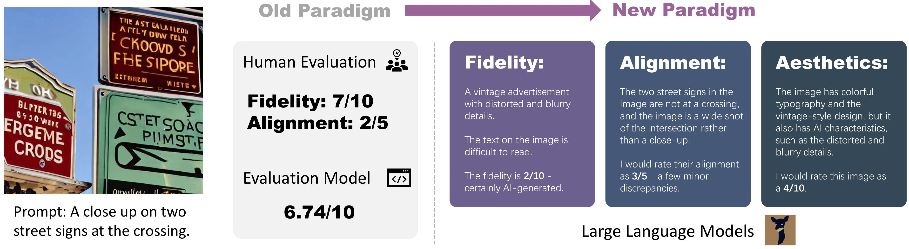
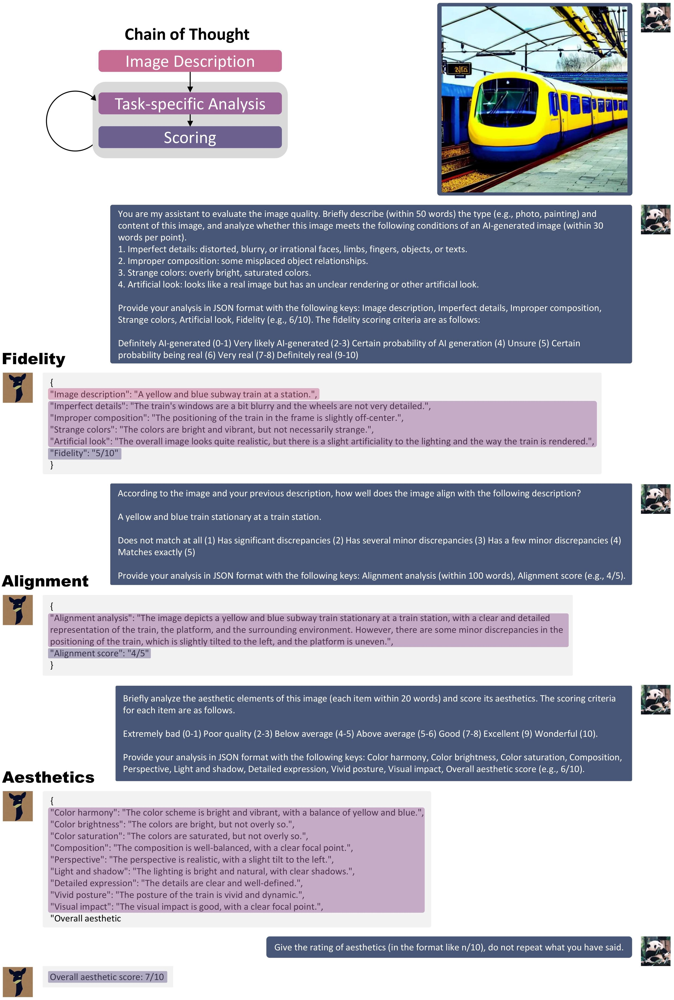

# Benchmarking-Awesome-Diffusion-Models
This is the repository of benchmarks for text-to-image diffusion models (both community models and academic models). We used COCO Caption and DrawBench as prompt sets to evaluate the models' basic and advanced capabilities to generate images based on texts. 

The metrics considered in this repo are: 
1) [CLIPScore](https://github.com/jmhessel/clipscore), which measures the text-image alignment
2) [Improved Aesthetic Predictor](https://github.com/christophschuhmann/improved-aesthetic-predictor), which measures how good-looking an image is
3) [ImageReward](https://github.com/THUDM/ImageReward), which measures the human rating of an image
4) [Human Preference Score](https://tgxs002.github.io/align_sd_web/), which measures the human preference of an image
5) [***X-IQE***](https://arxiv.org/abs/2305.10843), a comprehensive and explainable metric based on visual LLMs (MiniGPT-4)

The weighted average score is calculated as: 

CLIPScore * 15% + AestheticPred * 15% + ImageReward * 20% + HPS * 20% + (X-IQE Fidelity + X-IQE Alignment + X-IQE Aesthetics) * 10%

where all scores are normalized into [0,1], so the weighted average score will be in [0,1], larger is better. We hope this project will help with your study and research.

## COCO Caption Benchmark

### Benchmark Introduction
We randomly sample 1000 captions from the [COCO Caption](https://github.com/tylin/coco-caption) dataset (2014). This prompt set mainly contains common human, animal, object, and scene descriptions. It can evaluate the diffusion models' basic generation ability.

Examples:
1. A man standing in a snowy forest on his skis.
2. A toilet is in a large room with a magazine rack, sink, and tub.
3. Four large elephants are watching over their baby in the wilderness.
4. A street vendor displaying various pieces of luggage for sale.
5. White commuter train traveling in rural hillside area.


### COCO Caption Rankings
<table border="2" >
	<tr >
	<th rowspan="2">Rank</th>
	<th rowspan="2">Model</th>
	<th rowspan="2">Weighted Avg. Score</th>
	<th rowspan="2">CLIP</th>
	<th rowspan="2">Aes. Pred.</th>
	<th rowspan="2">Image Reward</th>
	<th rowspan="2">HPS</th>
	<th colspan="4">X-IQE</th>
	</tr>
	<tr >
	<th>Fidelity</th><th>Alignment</th><th>Aesthetics</th><th>Overall</th>
	</tr>
	<tr >
	<td>1</td>
	<td><a href="https://huggingface.co/DeepFloyd/IF-I-XL-v1.0">DeepFloyd-IF-XL</a></td>
		<td>0.865</td>
		<td>0.828</td>        
		<td>5.26</td>
		<td>0.703</td>
		<td>0.1994</td>
		<td>5.55</td>
		<td>3.52</td>
		<td>5.79</td>
		<td>14.86</td>
	</tr>
	<tr >
	<td>2</td>
	<td><a href="https://huggingface.co/SG161222/Realistic_Vision_V1.4">Realistic Vision<sup>SD</sup></a></td>
		<td>0.835</td>
		<td>0.825</td>
		<td>5.44</td>
		<td>0.551</td>
		<td>0.2023</td>
		<td>5.36</td>
		<td>3.39</td>
		<td>5.87</td>
		<td>14.62</td>
	</tr>
	<tr >
	<td>3</td>
	<td><a href="https://huggingface.co/dreamlike-art/dreamlike-photoreal-2.0">Dreamlike Photoreal 2.0<sup>SD</sup></a></td>
		<td>0.830</td>
		<td>0.824</td>
		<td>5.47</td>
		<td>0.399</td>
		<td>0.2021</td>
		<td>5.50</td>
		<td>3.33</td>
		<td>5.78</td>
		<td>14.61</td>
	</tr>
	<tr >
	<td>4</td>
	<td><a href="https://huggingface.co/stabilityai/stable-diffusion-2-1">Stable Diffusion 2.1</a></td>
		<td>0.828</td>
		<td>0.831</td>
		<td>5.42</td>
		<td>0.472</td>
		<td>0.1988</td>
		<td>5.52</td>
		<td>3.45</td>
		<td>5.77</td>
		<td>14.74</td>
	</tr>
	<tr >
	<td>5</td>
	<td><a href="https://huggingface.co/XpucT/Deliberate">Deliberate<sup>SD</sup></a></td>
		<td>0.813</td>
		<td>0.827</td>
		<td>5.41</td>
		<td>0.517</td>
		<td>0.2024</td>
		<td>5.35</td>
		<td>3.34</td>
		<td>5.81</td>
		<td>14.50</td>
	</tr>
	<tr >
	<td>6</td>
	<td><a href="https://huggingface.co/stablediffusionapi/majicmixrealistic">MajicMix Realistic<sup>SD</sup></a></td>
		<td>0.775</td>
		<td>0.828</td>
		<td>5.60</td>
		<td>0.477</td>
		<td>0.2015</td>
		<td>5.27</td>
		<td>3.10</td>
		<td>5.86</td>
		<td>14.23</td>
	</tr>
	<tr >
	<td>7</td>
	<td><a href="https://huggingface.co/windwhinny/chilloutmix">ChilloutMix<sup>SD</sup></a></td>
		<td>0.754</td>
		<td>0.820</td>
		<td>5.46</td>
		<td>0.433</td>
		<td>0.2008</td>
		<td>5.40</td>
		<td>3.05</td>
		<td>5.87</td>
		<td>14.32</td>
	</tr>
	<tr >
	<td>8</td>
	<td><a href="https://huggingface.co/prompthero/openjourney">Openjourney<sup>SD</sup></a></td>
		<td>0.718</td> 
		<td>0.806</td> 
		<td>5.38</td>
		<td>0.244</td>
		<td>0.1990</td>
		<td>5.44</td>
		<td>3.37</td>
		<td>5.96</td>
		<td>14.77</td>
	</tr>
	<tr >
	<td>9</td>
	<td><a href="https://huggingface.co/johnslegers/epic-diffusion">Epic Diffusion<sup>SD</sup></a></td>
		<td>0.691</td>
		<td>0.810</td>
		<td>5.30</td>
		<td>0.265</td>
		<td>0.1982</td>
		<td>5.54</td>
		<td>3.31</td>
		<td>5.71</td>
		<td>14.56</td>
	</tr>
	<tr >
	<td>10</td>
	<td><a href="https://huggingface.co/runwayml/stable-diffusion-v1-5">Stable Diffusion 1.5</a></td>
		<td>0.656</td>
		<td>0.808</td>
		<td>5.22</td>
		<td>0.242</td>
		<td>0.1974</td>
		<td>5.48</td>
		<td>3.31</td>
		<td>5.79</td>
		<td>14.58</td>
	</tr>
	<tr >
	<td>11</td>
	<td><a href="https://huggingface.co/CompVis/stable-diffusion-v-1-4-original">Stable Diffusion 1.4</a></td>
		<td>0.599</td>
		<td>0.803</td>
		<td>5.22</td>
		<td>0.104</td>
		<td>0.1966</td>
		<td>5.47</td>
		<td>3.29</td>
		<td>5.76</td>
		<td>14.52</td>
	</tr>
	<tr >
	<td>12</td>
	<td><a href="https://huggingface.co/kuprel/min-dalle">DALL·E mini</a></td>
		<td>0.416</td>
		<td>0.807</td>
		<td>4.72</td>
		<td>-0.025</td>
		<td>0.1901</td>
		<td>5.52</td>
		<td>2.96</td>
		<td>5.78</td>
		<td>14.26</td>
	</tr>
	<tr >
	<td>13</td>
	<td><a href="https://huggingface.co/shi-labs/versatile-diffusion">Versatile Diffusion</a></td>
		<td>0.410</td>
		<td>0.779</td>
		<td>5.19</td>
		<td>-0.245</td>
		<td>0.1927</td>
		<td>5.59</td>
		<td>2.97</td>
		<td>5.72</td>
		<td>14.28</td>
	</tr>
	<tr >
	<td>14</td>
	<td><a href="https://huggingface.co/CompVis/ldm-text2im-large-256">Latent Diffusion</a></td>
		<td>0.131</td>
		<td>0.795</td>
		<td>4.40</td>
		<td>-0.587</td>
		<td>0.1881</td>
		<td>5.42</td>
		<td>2.71</td>
		<td>5.58</td>
		<td>13.71</td>
	</tr>
	<tr >
	<td>15</td>
	<td><a href="https://huggingface.co/microsoft/vq-diffusion-ithq">VQ Diffusion</a></td>
		<td>0.103</td>
		<td>0.782</td>
		<td>4.62</td>
		<td>-0.618</td>
		<td>0.1889</td>
		<td>5.40</td>
		<td>2.83</td>
		<td>5.39</td>
		<td>13.62</td>
	</tr>
</table>

($Name^{SD}$ means the model was fine-tuned based on stable diffusion)

On COCO Captions, the evaluation methods reached similar conclusions, which reflects our intuition for these text-to-image algorithms (e.g., SD2.1>SD1.5>SD1.4). In addition, Openjourney performs the best among the methods fine-tuned on SD.

### Sample Illustration

```
Prompt: A baseball player holding a bat on a field
```


## DrawBench Benchmark

### Benchmark Introduction
We use all 200 prompts from the [DrawBench](https://docs.google.com/spreadsheets/d/1y7nAbmR4FREi6npB1u-Bo3GFdwdOPYJc617rBOxIRHY/edit#gid=0) (2022). This prompt set mainly contains challenging situations, and can evaluate the diffusion models' advanced generation capabilities.

Examples:
1. A pink colored giraffe. (abnormal color)
2. A bird scaring a scarecrow. (abnormal scene)
3. Five cars on the street. (counting)
4. A connection point by which firefighters can tap into a water supply. (ambiguous description)
5. A banana on the left of an apple. (position)
6. Matutinal. (rare words)
7. A storefront with 'Google Research Pizza Cafe' written on it. (text)


### DrawBench Rankings
<table border="2" >
	<tr >
	<th rowspan="2">Rank</th>
	<th rowspan="2">Model</th>
	<th rowspan="2">Weighted Avg. Score</th>
	<th rowspan="2">CLIP</th>
	<th rowspan="2">Aes. Pred.</th>
	<th rowspan="2">Image Reward</th>
	<th rowspan="2">HPS</th>
	<th colspan="4">X-IQE</th>
	</tr>
	<tr >
	<th>Fidelity</th><th>Alignment</th><th>Aesthetics</th><th>Overall</th>
	</tr>
	<tr >
	<td>1</td>
	<td><a href="https://huggingface.co/SG161222/Realistic_Vision_V1.4">Realistic Vision<sup>SD</sup></a></td>
		<td>0.891</td>
		<td>0.813</td>
		<td>5.34</td>
		<td>0.370</td>
		<td>0.2009</td>
		<td>5.43</td>
		<td>2.79</td>
		<td>5.58</td>
		<td>13.80</td>
	</tr>
	<tr >
	<td>2</td>
	<td><a href="https://huggingface.co/DeepFloyd/IF-I-XL-v1.0">DeepFloyd-IF-XL</a></td>
		<td>0.871</td> 
		<td>0.827</td> 
		<td>5.10</td>
		<td>0.54</td>
		<td>0.1977</td>
		<td>5.32</td>
		<td>2.96</td>
		<td>5.64</td>
		<td>13.92</td>
	</tr>
	<td>3</td>
	<td><a href="https://huggingface.co/dreamlike-art/dreamlike-photoreal-2.0">Dreamlike Photoreal 2.0<sup>SD</sup></a></td>
		<td>0.821</td>
		<td>0.815</td>
		<td>5.40</td>
		<td>0.260</td>
		<td>0.2000</td>
		<td>5.36</td>
		<td>2.80</td>
		<td>5.35</td>
		<td>13.51</td>
	</tr>
	<tr >
	<td>4</td>
	<td><a href="https://huggingface.co/XpucT/Deliberate">Deliberate<sup>SD</sup></a></td>
		<td>0.812</td>
		<td>0.815</td>
		<td>5.40</td>
		<td>0.519</td>
		<td>0.2016</td>
		<td>5.21</td>
		<td>2.75</td>
		<td>5.28</td>
		<td>13.24</td>
	</tr>
	<tr >
	<td>5</td>
	<td><a href="https://huggingface.co/stablediffusionapi/majicmixrealistic">MajicMix Realistic<sup>SD</sup></a></td>
		<td>0.762</td>
		<td>0.802</td>
		<td>5.49</td>
		<td>0.258</td>
		<td>0.2001</td>
		<td>5.33</td>
		<td>2.57</td>
		<td>5.31</td>
		<td>13.21</td>
	</tr>
	<tr >
	<td>6</td>
	<td><a href="https://huggingface.co/windwhinny/chilloutmix">ChilloutMix<sup>SD</sup></a></td>
		<td>0.658</td>
		<td>0.803</td>
		<td>5.34</td>
		<td>0.169</td>
		<td>0.1987</td>
		<td>5.07</td>
		<td>2.60</td>
		<td>5.37</td>
		<td>13.04</td>
	</tr>
	<tr >
	<td>7</td>
	<td><a href="https://huggingface.co/CompVis/stable-diffusion-v-1-4-original">Stable Diffusion 1.4</a></td>
		<td>0.624</td>
		<td>0.793</td>
		<td>5.09</td>
		<td>-0.029</td>
		<td>0.1945</td>
		<td>5.32</td>
		<td>2.72</td>
		<td>5.40</td>
		<td>13.44</td>
	</tr>
	<tr >
	<td>8</td>
	<td><a href="https://huggingface.co/prompthero/openjourney">Openjourney<sup>SD</sup></a></td>
		<td>0.595</td>
		<td>0.787</td>
		<td>5.35</td>
		<td>0.056</td>
		<td>0.1972</td>
		<td>5.14</td>
		<td>2.62</td>
		<td>5.21</td>
		<td>12.97</td>
	</tr>
	<tr >
	<td>9</td>
	<td><a href="https://huggingface.co/runwayml/stable-diffusion-v1-5">Stable Diffusion 1.5</a></td>
		<td>0.594</td>
		<td>0.795</td>
		<td>5.14</td>
		<td>0.072</td>
		<td>0.1954</td>
		<td>5.18</td>
		<td>2.61</td>
		<td>5.35</td>
		<td>13.14</td>
	</tr>
	<tr >
	<td>10</td>
	<td><a href="https://huggingface.co/stabilityai/stable-diffusion-2-1">Stable Diffusion 2.1</a></td>
		<td>0.576</td>
		<td>0.817</td>
		<td>5.31</td>
		<td>0.163</td>
		<td>0.1955</td>
		<td>5.10</td>
		<td>2.50</td>
		<td>5.04</td>
		<td>12.64</td>
	</tr>
	<tr >
	<td>11</td>
	<td><a href="https://huggingface.co/johnslegers/epic-diffusion">Epic Diffusion<sup>SD</sup></a></td>
		<td>0.574</td>
		<td>0.792</td>
		<td>5.16</td>
		<td>0.069</td>
		<td>0.1951</td>
		<td>5.14</td>
		<td>2.63</td>
		<td>5.32</td>
		<td>13.09</td>
	</tr>
	<tr >
	<td>12</td>
	<td><a href="https://huggingface.co/shi-labs/versatile-diffusion">Versatile Diffusion</a></td>
		<td>0.417</td>
		<td>0.756</td>
		<td>5.08</td>
		<td>-0.489</td>
		<td>0.1901</td>
		<td>5.31</td>
		<td>2.52</td>
		<td>5.42</td>
		<td>13.25</td>
	</tr>
	<tr >
	<td>13</td>
	<td><a href="https://huggingface.co/kuprel/min-dalle">DALL·E mini</a></td>
		<td>0.390</td>
		<td>0.770</td>
		<td>4.65</td>
		<td>-0.250</td>
		<td>0.1895</td>
		<td>5.41</td>
		<td>2.33</td>
		<td>5.31</td>
		<td>13.05</td>
	</tr>
	<tr >
	<td>14</td>
	<td><a href="https://huggingface.co/CompVis/ldm-text2im-large-256">Latent Diffusion</a></td>
		<td>0.247</td>
		<td>0.777</td>
		<td>4.32</td>
		<td>-0.476</td>
		<td>0.1877</td>
		<td>5.25</td>
		<td>2.29</td>
		<td>5.24</td>
		<td>12.78</td>
	</tr>
	<tr >
	<td>15</td>
	<td><a href="https://huggingface.co/microsoft/vq-diffusion-ithq">VQ Diffusion</a></td>
		<td>0.067</td>
		<td>0.741</td>
		<td>4.41</td>
		<td>-1.084</td>
		<td>0.1856</td>
		<td>5.16</td>
		<td>2.35</td>
		<td>5.17</td>
		<td>12.68</td>
	</tr>
</table>

($Name^{SD}$ means the model was fine-tuned based on stable diffusion)

On DrawBench prompts, the results are not consistent with COCO. The resampling of the more common prompts during the fine-tuning stage (SD1.5, SD2.1, Openjourney) usually negatively affecting the models' ability on hard prompts.

### Sample Illustration

```
Prompt: A large thick-skinned semiaquatic African mammal, with massive jaws and large tusks
```


## TODO

Adding results of more awesome models on [Huggingface](https://huggingface.co/models?library=diffusers&sort=downloads).


## X-IQE: eXplainable Image Quality Evaluation

This method is proposed by the paper [X-IQE: eXplainable Image Quality Evaluation for Text-to-Image Generation with Visual Large Language Models](https://arxiv.org/abs/2305.10843), which leverages [MiniGPT-4](https://github.com/Vision-CAIR/MiniGPT-4) for explainable evaluation of images generated by text-to-image diffusion models. It brings us a new paradigm of meticulously designed step-by-step evaluation strategy: fidelity -> text-image alignment -> aesthetics.

<object data="Fig/method.pdf" type="application/pdf" width="100%"> 
</object>



A detailed process of evaluation is illustrated in the following:



For more details about the method, or running the demo on your own, please see [this page](/X-IQE/README.md) of X-IQE.

## Citation

If you find the benchmark method and results useful in your research, please consider citing:

    @article{chen2023x,
	  title={X-IQE: eXplainable Image Quality Evaluation for Text-to-Image Generation with Visual Large Language Models},
	  author={Chen, Yixiong},
	  journal={arXiv preprint arXiv:2305.10843},
	  year={2023}
	}


